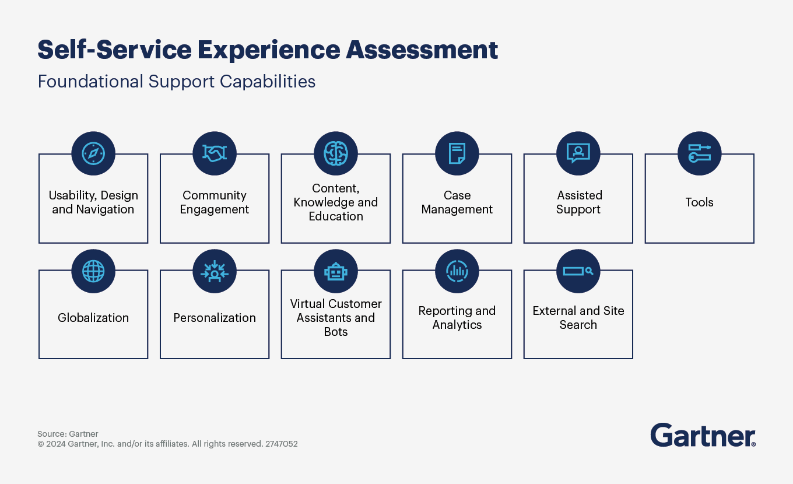

# Frontend app

The **frontend app** in Open Self Service is a high-performance, modular application built with **Next.js** and designed to serve as the foundation for composable customer portals. It provides a ready-to-use structure, pre-configured features, and customizable pages to accelerate development and deliver seamless customer experiences.

---

## Pages included in the app

The frontend app comes with pre-built pages to cover common customer portal functionalities. These pages can be extended or modified as needed.

The initial feature set of O2S was designed based on Gartner’s research on Customer Self-Service Capabilities: https://www.gartner.com/en/customer-service-support/topics/self-service-customer-service.
This research outlines the core functionalities required for effective self-service solutions, as illustrated in the image below.

### List of supported pages:

#### Login
A user authentication page integrated with **NextAuth**, supporting both email-based login and OAuth providers.

#### User account (planned)
Allow users to manage their profile information, including account settings, password updates, and preferences.

#### Dashboard
Provide a personalized overview of customer-specific data, such as services, payments, notifications, or quick links to other portal features.

#### Cases / Tickets (submission planned)
Enable users to create, view, and manage support tickets or service requests. Includes a detailed ticket view and status tracking.

#### Payments
Display payment history, pending invoices, and transaction details, with potential integration to payment APIs or billing systems.

#### Notifications
A page to display user-specific notifications, such as updates on tickets, services, or system alerts.

#### Services and products (planned)
Showcase a list of customer-specific services or products with detailed views. These pages can also integrate with APIs for service configuration or updates.

#### Knowledge base (planned)
A searchable help center powered by a CMS, enabling customers to find answers to their questions or browse categories.

#### Navigation and footer
Pre-configured navigation menus and footer components, easily managed via the CMS for updates and custom links.

---

## Features and benefits

### Customizable
The frontend app is a regular Next.js application, built with **shadcn/ui** and **Tailwind CSS**, making it easy to extend and customize its UI for your specific needs.
All standard Next.js features are supported.

### Headless CMS integration
All pages and components can be managed via a **headless CMS**, such as Strapi or Contentful, enabling non-technical users to update content effortlessly.

### Built-in responsiveness
The app is fully responsive, ensuring a consistent user experience across devices, from desktop to mobile.

### Authentication
The frontend app includes integration with **NextAuth** for user authentication, supporting multiple providers (e.g., Google, GitHub) out of the box.

### API-first approach
Communicate with the backend using the **SDK** to fetch harmonized data from the API Harmonization server, keeping the frontend decoupled and future-proof.

---

