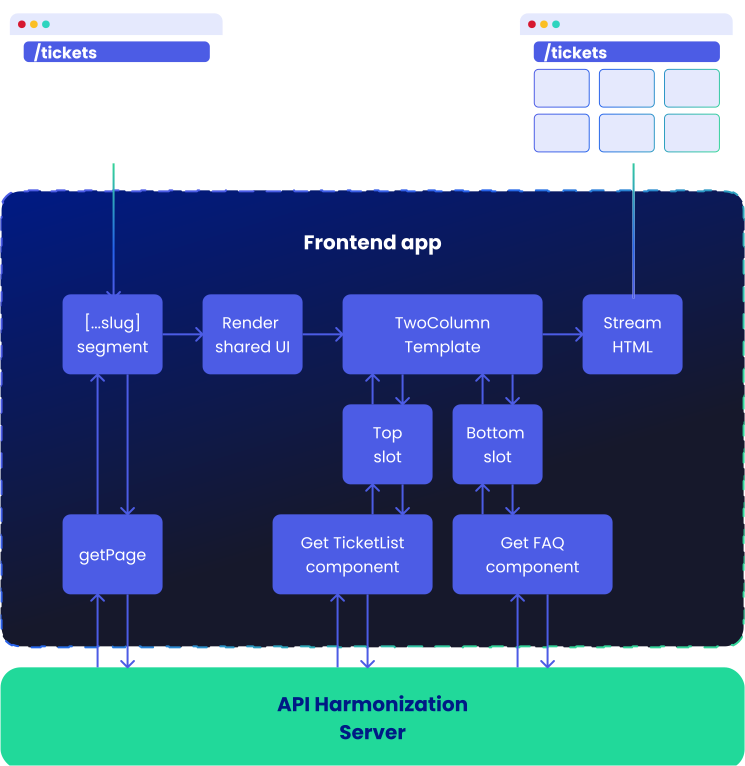
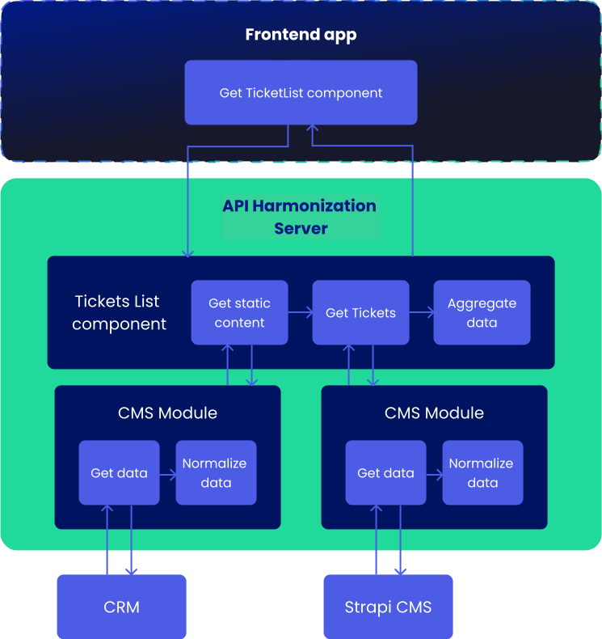

# Data flow

It's important to understand how the data flows between parts of O2S.
While there are only two applications, they are internally split into several smaller parts that communicate with each other.

This flow can be visualised on a high level like this:


<figure>


<figcaption>High-level data flow between Frontend app - API Harmonization - Integrations (CMS and others)</figcaption>

</figure>


## Frontend app

When users enter any page within the O2S through the browser, the server-side rendering process is started.
The first thing that happens is that a [catch-all segment](https://nextjs.org/docs/pages/building-your-application/routing/dynamic-routes#optional-catch-all-segments) of Next.js's Dynamic Routing mechanism is triggered.
It intercepts every URL and looks up whether there is a page definition in the CMS under that URL.


<figure>



<figcaption>Data flow within the Frontend app</figcaption>

</figure>


### Detailed explanation of Frontend app's data flow
1. A call to the API Harmonization server occurs for the page.
    ```typescript
    const { data } = await sdk.modules.getPage({ slug, locale });
    ```
2. If the page was found, an object with a page definition is returned.
3. Based on this response shared parts of the UI are rendered (like navigation or footer), but **no other components** are rendered yet.
4. The page response includes the template that should be used to render the page, together with the IDs of components that should be fetched.
    ```json
    {
        "__typename": "TwoColumnTemplate",
        "slots": {
            "top": [{ "__typename": "TicketListComponent", "id": "ticket-list-1" }],
            "left": [{ "__typename": "NotificationListComponent", "id": "notification-list-1" }],
            "right": [{ "__typename": "FaqComponent", "id": "faq-1" }],
            "bottom": [{ "__typename": "FaqComponent", "id": "faq-2" }]
        }
    }
    ```
5. Inside the template rendering, each component within each slot asks the API Harmonization server for their own data. This mechanism leverages the [streaming of server components](https://nextjs.org/docs/app/building-your-application/routing/loading-ui-and-streaming#what-is-streaming) to make component loading asynchronous while still keeping API requests server-side.
    ```typescript
    const data = await sdk.components.getFaq({ id });
    ```
6. If the API found that component in some database (like a CMS), component rendering starts and the HTML is streamed to the browser.

:::tip
Check the [Frontend app chapter](../main-components/frontend-app/index.md) for more details about this app.
:::

## API Harmonization server

When a request from the frontend app (no matter whether for a page or a component or anything else) is caught by the API Harmonization server, it is passed through several modules in order to compose the full response.

<figure>



<figcaption>Detailed data flow within the API Harmonization</figcaption>

</figure>

1. Firstly, a dedicated module within the `api-harmonization` app handles the request
    ```typescript title="declaring an endpoint that returns the TicketList component data"
    @Get()
    getTicketListComponent(@Headers() headers, @Query() query) {
        return this.service.getTicketListComponent(query, headers);
    }
    ```
2. Internal logic for handling this request is delegated to that module's service, where additional services are called for all data that is necessary to compose the full response. Depending on the actual needs, this can range from simple parallel request to more complex orchestration, where each subsequent call is based on previous ones, often conditionally.

    ```typescript title="composing the TicketList component from two different integrations"
    getTicketListComponent(query, headers) {
        // fetch static content and component config from a CMS integration
        const cms = this.cmsService.getTicketListComponent({
            ...query,
            locale: headers['x-locale']
        });

        return forkJoin([cms]).pipe(
            concatMap(([cms]) => {
                // fetch ticket list from a ticket integration using the config from CMS
                return this.ticketService
                    .getTicketList({
                        ...query,
                        limit: query.limit || cms.pagination?.limit || 1,
                        offset: query.offset || 0,
                    })
                    .pipe(map((tickets) => mapTicketList(tickets, cms, headers['x-locale'])));
            }),
        );
    }
    ```

3. The calls to the integration happen, which can be handled by various packages (either internal ones, or installed as dependencies). Inside such integrations different modules can be created in order to fetch the data from other external APIs.

    ```typescript title="fetching ticket list from an external API"
    export class TicketService implements Tickets.Service {
        getTicketList(options) {
            const tickets = this.httpClient.get(TICKETS_API_URL, { params: options });

            return forkJoin([tickets]).pipe(map(([tickets]) => mapTickets(tickets)));
        }
    }
    ```

4. After fetching data from an API, the response needs to be transformed into the normalized data model so that each integration returns it in exactly the same format, no matter where it came from. This makes it possible for the harmonization process to work in an API-agnostic way, composing data for frontend components without knowledge which API was actually used.

    ```typescript title="normalizing the TicketList component data from Strapi CMS"
    export const mapTicketListComponent = (
        data: GetComponentQuery,
    ): CMS.Model.TicketListComponent.TicketListComponent => {
        const component = data.component!.content[0];
        const configurableTexts = data.configurableTexts!;

        if (!component) {
            throw new NotFoundException();
        }

        switch (component.__typename) {
            case 'ComponentComponentsTicketList':
                return {
                    id: component.id,
                    title: component.title,
                    subtitle: component.subtitle,
                    table: mapTable(component.table),
                    fieldMapping: mapFields(component.fields),
                    pagination: mapPagination(component.pagination),
                    filters: mapFilters(component.filters),
                    noResults: {
                        title: component.noResults.title,
                        description: component.noResults.description,
                    },
                    labels: {
                        today: configurableTexts.dates.today,
                        yesterday: configurableTexts.dates.today,
                    },
                    detailsUrl: component.detailsURL,
                };
        }

        throw new NotFoundException();
    };
    ```

5. The normalized data from each integration is then returned back to the module that handled the request from the frontend app for it to be aggregated into one full response. That response usually combines static data from a CMS with dynamic from different APIs.

    ```typescript
    export const mapTicketList = (
        tickets: Tickets.Model.Tickets,
        cms: CMS.Model.TicketListComponent.TicketListComponent,
        locale: string,
    ): TicketListComponent => {
        return {
            __typename: 'TicketListComponent',
            id: cms.id,
            title: cms.title,
            subtitle: cms.subtitle,
            table: cms.table,
            pagination: cms.pagination,
            filters: cms.filters,
            noResults: cms.noResults,
            tickets: {
                total: tickets.total,
                data: tickets.data.map((ticket) => mapTicket(ticket, cms, locale)),
            },
        };
    };

    export const mapTicket = (
        ticket: Tickets.Model.Ticket,
        cms: CMS.Model.TicketListComponent.TicketListComponent,
        locale: string,
    ): Ticket => {
        return {
            id: ticket.id,
            topic: {
                label: cms.fieldMapping.topic?.[ticket.topic] || ticket.topic,
                value: ticket.topic,
            },
            type: {
                label: cms.fieldMapping.type?.[ticket.type] || ticket.type,
                value: ticket.type,
            },
            status: {
                label: cms.fieldMapping.status?.[ticket.status] || ticket.status,
                value: ticket.status,
            },
            createdAt: formatDateRelative(ticket.createdAt, locale, cms.labels.today, cms.labels.yesterday),
            updatedAt: formatDateRelative(ticket.updatedAt, locale, cms.labels.today, cms.labels.yesterday),
            detailsUrl: format(cms.detailsUrl, {
                id: ticket.id,
            }),
        };
    };
    ```

6. After harmonization process is finished, the response goes back to the frontend app for further page rendering.

:::tip
Check the [Harmonization layer chapter](../main-components/harmonization-app/index.md) for more details about this app.
:::
